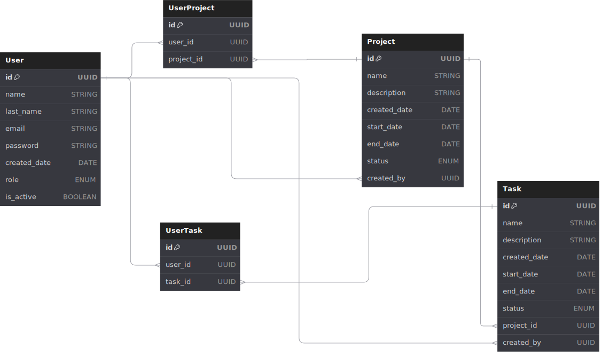

# Proyecto DesafioLatam - Express

## Uso

Para iniciar el servidor, ejecuta:

```bash
npm run dev
```

Para ejecutar los test respectivos

```bash
npm run test
```

El servidor estará disponible en `http://localhost:3000` por default,
Puerto configurable según .env PORT

Comandos para seteo y levantamiento de DB y tablas en src/config/db.sql

### DIAGRAMA DE DB

-- Creado en https://dbdiagram.io/d



### ---------
